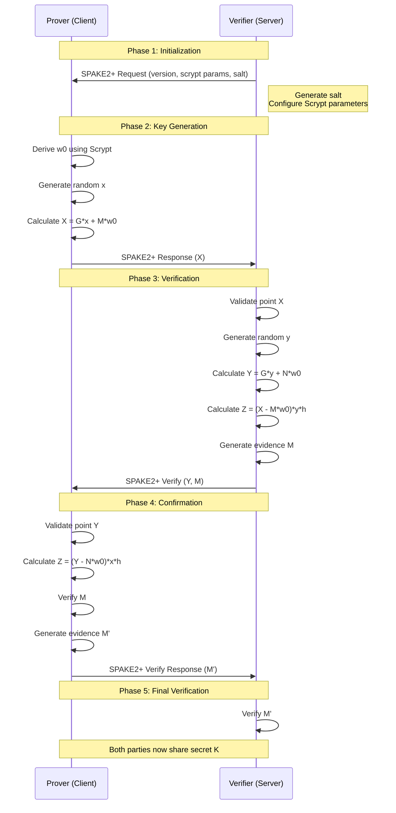

# SPAKE2+ Key Exchange Implementation

A secure implementation of the SPAKE2+ password-authenticated key exchange protocol using Spring Boot and Bouncy Castle.

## Overview

This project implements the SPAKE2+ protocol, a secure key exchange mechanism that allows two parties to establish a shared secret key based on a password, while protecting against offline dictionary attacks.

## Protocol Flow



## Technical Details

### Cryptographic Specifications
- **Protocol**: SPAKE2+ (Password-Authenticated Key Exchange)
- **Curve**: secp256r1 (NIST P-256)
- **Key Derivation**: Scrypt with configurable parameters
- **MAC**: HMAC-SHA256
- **Library**: Bouncy Castle

### Key Components

1. **Service Layer (`Spake2PlusService`)**
   - Implements core cryptographic operations
   - Manages protocol state and key generation
   - Handles verification and validation

2. **REST API (`Spake2PlusController`)**
   - `/api/spake2plus/initiate`: Start key exchange
   - `/api/spake2plus/respond`: Process initial request
   - `/api/spake2plus/verify`: Verify and generate evidence
   - `/api/spake2plus/verify-response`: Process verification
   - `/api/spake2plus/final-verify`: Final verification

3. **Model Classes**
   - `Spake2PlusRequest`: Initial configuration and parameters
   - `Spake2PlusResponse`: Prover's public share
   - `Spake2PlusVerify`: Verifier's public share and evidence
   - `Spake2PlusVerifyResponse`: Prover's evidence
   - `ProverOutput`: Prover's cryptographic material
   - `VerifierOutput`: Verifier's cryptographic material

## Security Features

1. **Cryptographic Security**
   - Secure random number generation
   - Point validation on curve
   - Constant-time comparisons
   - Key separation (CK, SK)

2. **Protocol Security**
   - Password-based authentication
   - Protection against offline dictionary attacks
   - Forward secrecy
   - Mutual authentication

## Getting Started

### Prerequisites
- Java 17 or higher
- Gradle 7.x or higher

### Building the Project
```bash
./gradlew build
```

### Running the Application
```bash
./gradlew run
```

The application will start on `http://localhost:8080` with Swagger UI available at `http://localhost:8080/swagger-ui.html`

## API Usage Example

1. **Initiate Key Exchange**
```bash
POST /api/spake2plus/initiate?vehicleBrand=Toyota
```

2. **Process Request**
```bash
POST /api/spake2plus/respond
{
  "protocolVersion": "1.0",
  "scryptConfig": {
    "n": 32768,
    "r": 8,
    "p": 1
  },
  "salt": "...",
  "vehicleBrand": "Toyota",
  "supportedVersions": ["1.0"]
}
```

3. **Verify Response**
```bash
POST /api/spake2plus/verify
[prover's X value]
```

4. **Process Verification**
```bash
POST /api/spake2plus/verify-response
{
  "Y": "...",
  "M": "..."
}
```

5. **Final Verification**
```bash
POST /api/spake2plus/final-verify
[prover's M value]
```

## Security Considerations

1. **Production Use**
   - Implement proper error handling
   - Add comprehensive logging
   - Use secure key storage
   - Implement rate limiting
   - Add request validation

2. **Side-Channel Protection**
   - Use constant-time operations
   - Implement proper cleanup
   - Avoid timing attacks
   - Secure memory handling

## License

This project is licensed under the MIT License - see the LICENSE file for details.

## References

- [SPAKE2+ Specification](https://datatracker.ietf.org/doc/html/rfc9383)
- [CCC Digital Key Specification](https://carconnectivity.org/digital-key/)
